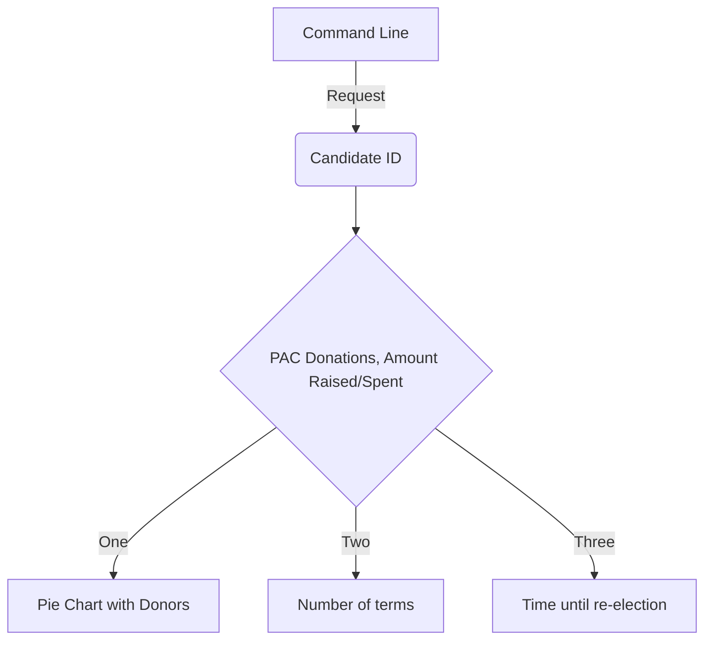

## Building an easier way to learn about Federal Politicians

## Hypothesis

## Data Sources

- **OpenFEC API** — PAC disbursements (Schedule B) to candidate campaigns, 2022 cycle

# 1. Install dependencies
pip install -r requirements.txt

# 2. Add your API key (from api.data.gov) to .env
echo "API_KEY=your_key_here" > .env

# 3. Run the full pipeline
python main.py
